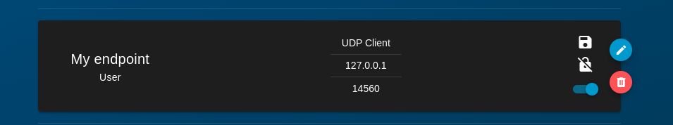
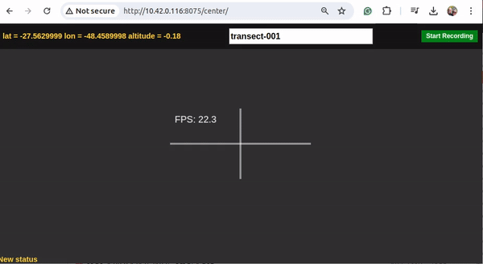
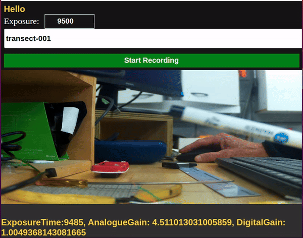

# Pi GPX Camera
*Pi GPX Camera* is a simple Python application designed to stream hardware encoded h.264 from a Raspberry Pi equiped with a HQ camera module, directly to a browser and allow recording of full res mjpeg stream. 


# Viewing
When server.py is running the feed can be vied from any broswer via the following urls. **_rpi_address_** is the ip address or hostname of your Raspberry Pi, and **_serverPort_** is the port you set in the configuration section.  

1. The primary viewing screen  (not currently workimg!!!)
    ```
    http://<rpi_address>:<serverPort>/   
    ```
2. The focus peaking screen 
    ```
    http://<rpi_address>:<serverPort>/focus/
    ```
3. The center reticle screen 
    ```
    http://<rpi_address>:<serverPort>/center/
    ```

# Installation
1. [Ensure the camera module is properly connected to the Raspberry Pi](https://projects.raspberrypi.org/en/projects/getting-started-with-picamera/2) with Bullseye or later based OS.


2. If Needed Disable legacy camera with `sudo raspi-config`

3. Bullseye and above come with Picamera2, if not installed then follow [Picamera2](https://datasheets.raspberrypi.com/camera/picamera2-manual.pdf) documentation

    ``` sh
    sudo apt-get install python3-picamera2
    ```

5. Install the [Pi GPX Camera package](https://github.com/Revive-Our-Gulf/pi-gpx-camera) and create a venv. 
    
    ``` sh
    mkdir ~/repos
    cd repos
    git clone https://github.com/Revive-Our-Gulf/pi-gpx-camera.git
    cd pi-gpx-camera
    ```

    If running with a camera then set up a venv with --system-site-packages

    ``` sh
    python -m venv --system-site-packages 'venv'
    source ./venv/bin/activate
    pip install --upgrade pip
    pip install -e '.[cam]'
    ```

    If you arent using the camera then don't set --system-site-packages 
    ``` sh
    python -m venv  'venv'
    source ./venv/bin/activate
    pip install --upgrade pip
    pip install -e .
    ```

# Mavlink
Setup a MAV endpoint in Blueos as follows 

This allows the gpx info to be collected .  If this is running on another computer than BlueOS then the address will need to be the computers ip address, same port 14570.

On the actual bluerov I had to set it to 
```
UDP Client
192.168.2.2
14570
```

# Usage

``` sh
~/repos/pi-gpx-camera/venv/bin/gpxcam -h
usage: gpxcam [-h] [--resolution RESOLUTION] [--framerate_record FRAMERATE_RECORD] [--framerate_camera FRAMERATE_CAMERA] [--jpg_quality JPG_QUALITY] [--port PORT]

Run the Rpi camera app.

options:
  -h, --help            show this help message and exit
  --resolution RESOLUTION, -r RESOLUTION
                        Resolution of the video
  --framerate_record FRAMERATE_RECORD, -fr FRAMERATE_RECORD
                        Framerate of the record
  --framerate_camera FRAMERATE_CAMERA, -fc FRAMERATE_CAMERA
                        Framerate of the camera
  --jpg_quality JPG_QUALITY, -q JPG_QUALITY
                        Quality of the JPEG encoding
  --port PORT, -p PORT  Quality of the JPEG encoding
```

# To Run

Normally this will automatically start on boot as a service, see services below
``` sh
 ~/repos/pi-gpx-camera/venv/bin/gpxcam
```
Then on browser navigate to  [http://10.42.0.116:8075/center/](http://10.42.0.116:8075/center/) 



Start recording will begin a save of the gpx file and camera video in `~/repos/pi-gpx-camera/data`
The video file is mjpeg full res images but is only create if the camera is present.

You can set the name the files saved in the input box.

You can set the exposure time for the camera fromm 100us to 20 millisecs


# File Manager

The view, download and delete files navigate to 

> **Note**: The window needs to be manually refreshed to see new files (needs a periodic update /  file watcher)


You may need to start the filemanager (if not running as a service)
``` sh
filemanager
```

# To run as a service

Run this script so the server runs at startup

``` sh
./scripts/setup-service.sh 
```
Show Status of the service 
``` sh
systemctl status runserver.service
systemctl status filemanager.service
```

To stop and/or disable the service 
``` sh
sudo systemctl stop runserver.service
sudo systemctl stop filemanager.service
# and/or
sudo systemctl disable runserver.service
sudo systemctl disable filemanager.service
```
To show the log
``` sh
journalctl -u runserver -n 50
```

# Optional configuration
open server.py and edit the following section of code as needed. 
- The webserver will run on the port you set **_serverPort_** to.  
- Refer to the Picamera2 documentation for details on how to configure it. A lage number of options exist 


#  if not running on Blue-os rPi
The Blue os might be using legacy camera, check first:

Disable legacy camera with `sudo raspi-config`


